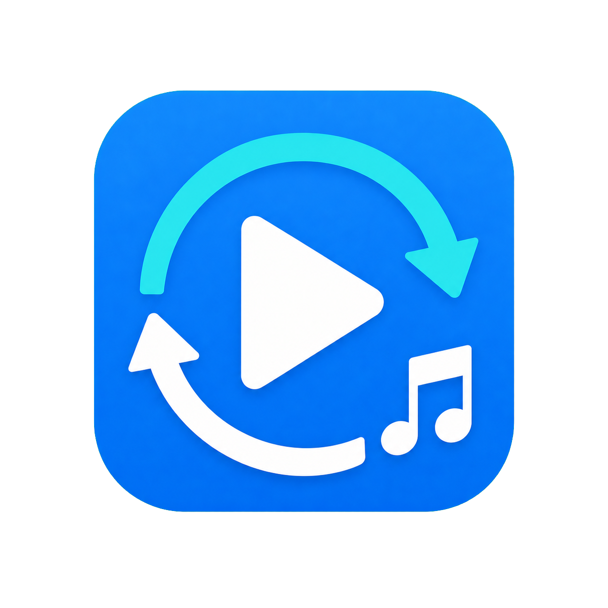

<div align="center">
  
  <h1>B站 M4S 转换器</h1>
  <p><strong>把零散的 M4S，变成随处可播的 MP3 / MP4。</strong></p>
  <p>一个轻量、源代码公开、无需安装的 Windows 图形工具。</p>

  [](https://github.com/onism11/bilibili-m4s-converter/releases/latest)
  [](https://github.com/onism11/bilibili-m4s-converter/releases/latest)
  [](https://ffmpeg.org/)

  [下载最新版](https://github.com/onism11/bilibili-m4s-converter/releases/latest) · [推荐搭配 Video Roll](https://videoroll.app/)
</div>

## 为什么需要它？

从 B 站或其他网页保存的视频，有时会得到分离的 `.m4s` 视频流和音频流：视频没有声音，音频也无法直接放进常用播放器。

本工具把麻烦的 FFmpeg 命令封装成简单的 Windows 图形界面：选文件、选格式、点击转换，就完成了。

## 功能

- 🎵 音频 `.m4s` 一键转换为 `.mp3`
- 🎬 视频 `.m4s` 快速封装为 `.mp4`
- 🔊 合并独立的视频 `.m4s` 与音频 `.m4s`
- ⚡ 视频流直接封装，不重复编码、不损失画质
- 🛡️ 源文件只读处理，不会被修改
- 🧩 自动兼容部分 B 站缓存文件的 9 字节 `000000000` 前缀
- 🖥️ 原生 Windows 图形界面，也支持 PowerShell 命令行

## 推荐搭配 Video Roll

[Video Roll](https://videoroll.app/) 是一款面向 HTML5 网页视频的浏览器扩展，支持 Bilibili 等网站，并提供视频下载、倍速、画中画、截图、旋转、音量增强等功能。

推荐工作流：

1. 使用 Video Roll 在浏览器中发现并下载你有权保存的视频。
2. 如果下载结果已经是普通 MP4，直接播放即可。
3. 如果得到 `.m4s` 文件或分离的音视频流，使用本工具转换为 MP3 或合并为 MP4。

> 请仅下载和处理你拥有使用权的内容，并遵守网站条款与当地法律。

## 快速开始

### 1. 安装 FFmpeg

本工具需要 [FFmpeg](https://ffmpeg.org/)。安装后，在 PowerShell 中执行以下命令应能看到版本信息：

```powershell
ffmpeg -version
```

### 2. 下载并运行

1. 前往 [Releases](https://github.com/onism11/bilibili-m4s-converter/releases/latest) 下载 `M4S-Converter-Windows-v1.0.0.zip`。
2. 解压整个压缩包，不要只取出 EXE。
3. 双击 `M4S-Converter.exe`。

`M4S-Converter.exe`、`m4s-converter.ps1` 与 `assets` 文件夹需要放在一起。

### 转 MP3

1. 输出格式选择 `MP3`。
2. 在“音频 m4s”一栏选择文件，不需要视频文件。
3. 选择码率和输出位置，点击“开始转换”。

### 转 MP4

1. 在“视频 m4s”一栏选择视频文件。
2. 如果视频没有声音，在“配套音频（可选）”中选择对应的音频 `.m4s`。
3. 输出格式选择 `MP4`，点击“开始转换”。

## 命令行

音频转 MP3：

```powershell
.\m4s-converter.ps1 -InputPath .\audio.m4s -Format mp3 -OutputPath .\audio.mp3
```

合并视频和音频：

```powershell
.\m4s-converter.ps1 -InputPath .\video.m4s -AudioPath .\audio.m4s -Format mp4 -OutputPath .\video.mp4
```

覆盖已有文件时加 `-Overwrite`。MP3 码率可通过 `-AudioBitrate 128`、`192`、`256` 或 `320` 指定。

## 从源码构建

重新编译 EXE 入口：

```powershell
powershell.exe -NoProfile -ExecutionPolicy Bypass -File .\build-launcher.ps1
```

生成 Release ZIP 与 SHA-256 校验文件：

```powershell
powershell.exe -NoProfile -ExecutionPolicy Bypass -File .\build-release.ps1
```

运行冒烟测试：

```powershell
powershell.exe -NoProfile -ExecutionPolicy Bypass -File .\tests\smoke-test.ps1
```

测试会在系统临时目录生成约 1 秒的音视频，完成后自动清理。

## 说明

- Windows 10 / 11
- PowerShell 5.1 或更高版本
- FFmpeg 需要可通过系统 `PATH` 访问
- 本项目与 Bilibili、Video Roll、FFmpeg 均无隶属或官方合作关系
